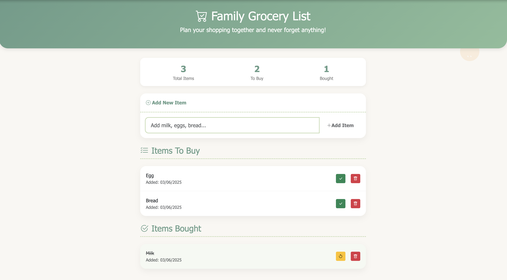

# Grocery List App

A full-stack grocery list management application built with Django REST Framework backend and React frontend. Keep track of your grocery items, mark them as bought, and manage your shopping efficiently.



## Features

- ✅ Add new grocery items
- 📝 View all items in your grocery list
- ✔️ Mark items as bought/not bought
- 🗑️ Delete items from your list
- 📊 View statistics (total, active, and bought items)
- 🔄 Real-time updates with notifications
- 📱 Responsive design with fruit-themed decorations

## Tech Stack

### Backend
- **Django 4.2.6** - Web framework
- **Django REST Framework** - API development
- **SQLite** - Database (development)
- **CORS Headers** - Cross-origin resource sharing

### Frontend
- **React** - Frontend framework
- **Vite** - Build tool and development server
- **CSS3** - Styling with custom animations

## Project Structure

```
grocery-app/
├── backend/
│   ├── backend/
│   │   ├── settings.py
│   │   ├── urls.py
│   │   └── wsgi.py
│   ├── groceryItem/
│   │   ├── models.py
│   │   ├── serializers.py
│   │   ├── views.py
│   │   └── urls.py
│   └── manage.py
└── frontend/
    ├── src/
    │   ├── components/
    │   ├── App.jsx
    │   └── main.jsx
    └── package.json
```

## API Endpoints

| Method | Endpoint | Description |
|--------|----------|-------------|
| GET | `/api/items/` | List all grocery items |
| POST | `/api/items/` | Create a new grocery item |
| GET | `/api/items/{id}/` | Retrieve a specific item |
| PATCH | `/api/items/{id}/` | Update item status (bought field) |
| DELETE | `/api/items/{id}/` | Delete an item |

## Installation & Setup

### Prerequisites
- Python 3.8+
- Node.js 16+
- npm or yarn

### Backend Setup

1. **Clone the repository**
   ```bash
   git clone <repository-url>
   cd grocery-app/backend
   ```

2. **Create virtual environment**
   ```bash
   python -m venv venv
   source venv/bin/activate  # On Windows: venv\Scripts\activate
   ```

3. **Install dependencies**
   ```bash
   pip install django djangorestframework django-cors-headers
   ```

4. **Run migrations**
   ```bash
   python manage.py makemigrations
   python manage.py migrate
   ```

5. **Create superuser (optional)**
   ```bash
   python manage.py createsuperuser
   ```

6. **Start the development server**
   ```bash
   python manage.py runserver 0.0.0.0:8000
   ```

The API will be available at `http://localhost:8000/api/`

### Frontend Setup

1. **Navigate to frontend directory**
   ```bash
   cd ../frontend
   ```

2. **Install dependencies**
   ```bash
   npm install
   ```

3. **Update API URL**
   
   In `src/App.jsx`, update the API_BASE_URL to match your backend:
   ```javascript
   const API_BASE_URL = 'http://localhost:8000/api';
   ```

4. **Start the development server**
   ```bash
   npm run dev
   ```

The frontend will be available at `http://localhost:5173`

## Configuration

### Backend Configuration

The Django settings include:

- **CORS Configuration**: Allows requests from React development server
- **Logging**: Configured to log to both file and console
- **REST Framework**: JSON rendering with error handling
- **Database**: SQLite for development (can be changed for production)

### Network Configuration

Currently configured for network access:
- Backend: `192.168.110.155:8000`
- Frontend: `192.168.110.155:5173`

Update these URLs in both `settings.py` and `App.jsx` based on your network setup.

## Usage

1. **Adding Items**: Use the input form to add new grocery items
2. **Managing Items**: 
   - Click the checkbox to mark items as bought/not bought
   - Use the delete button to remove items
3. **Viewing Stats**: Check the statistics section for item counts
4. **Notifications**: Real-time feedback for all actions

## API Response Format

### Grocery Item Object
```json
{
  "id": 1,
  "name": "Apples",
  "bought": false,
  "created_at": "2024-01-01T12:00:00Z",
  "updated_at": "2024-01-01T12:00:00Z"
}
```

### Error Response
```json
{
  "error": "Error message description"
}
```

## Development Notes

- **CSRF**: Disabled for API endpoints
- **Authentication**: Currently open (no authentication required)
- **Validation**: Server-side validation for all inputs
- **Error Handling**: Comprehensive error handling with logging
- **Status Updates**: Only PATCH updates allowed (not full PUT)

## Production Deployment

### Backend
1. Set `DEBUG = False` in settings.py
2. Configure proper database (PostgreSQL recommended)
3. Set up proper static file serving
4. Configure environment variables for sensitive data
5. Use a proper WSGI server (gunicorn, uWSGI)

### Frontend
1. Build the production bundle: `npm run build`
2. Serve static files through a web server (nginx, Apache)
3. Update API URLs to production endpoints

## Contributing

1. Fork the repository
2. Create a feature branch
3. Make your changes
4. Add tests if necessary
5. Submit a pull request

## License

This project is open source and available under the [MIT License](LICENSE).

## Support

If you encounter any issues or have questions, please create an issue in the repository.